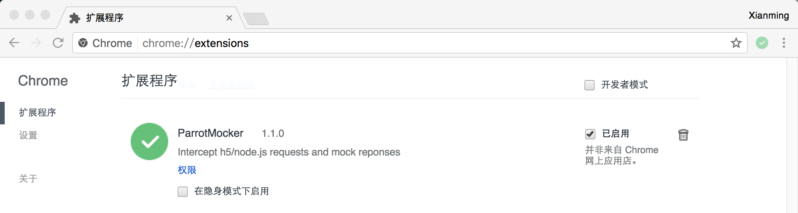
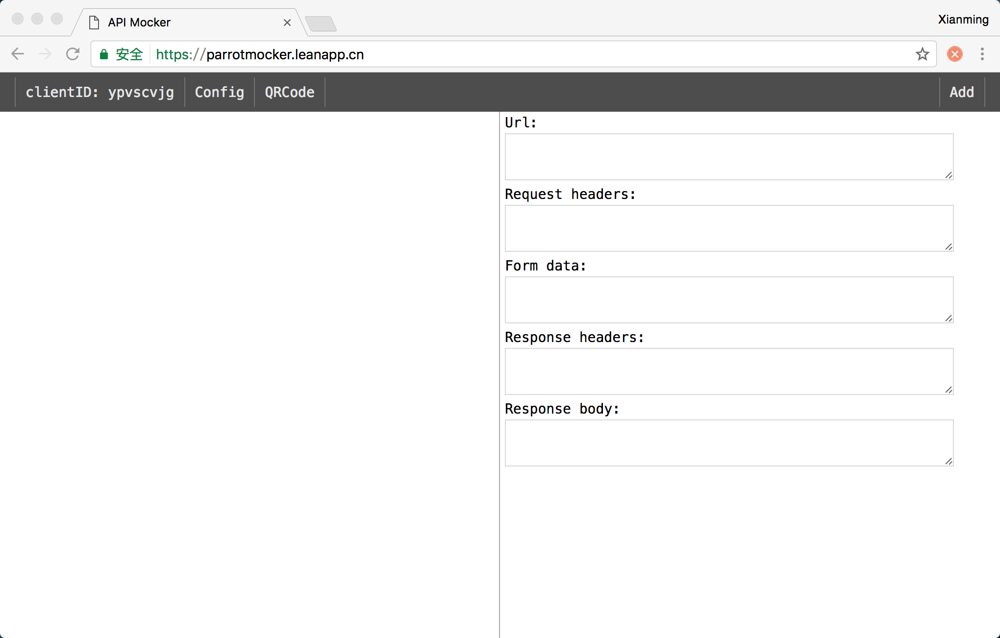
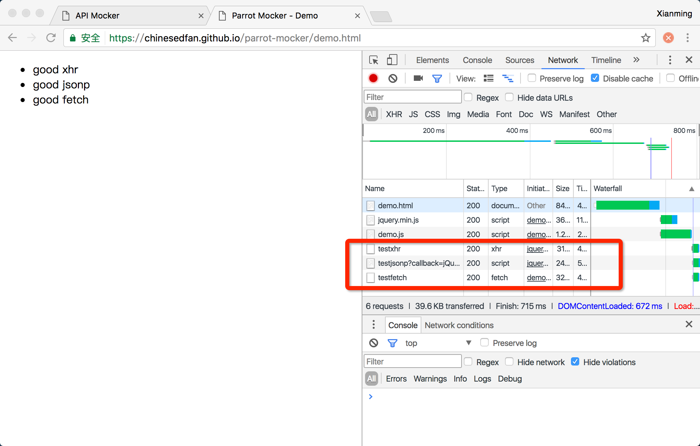
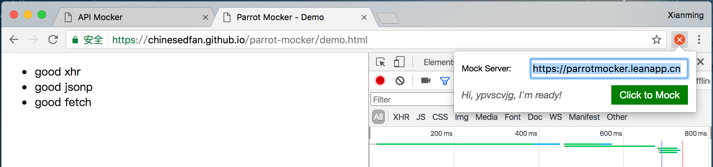
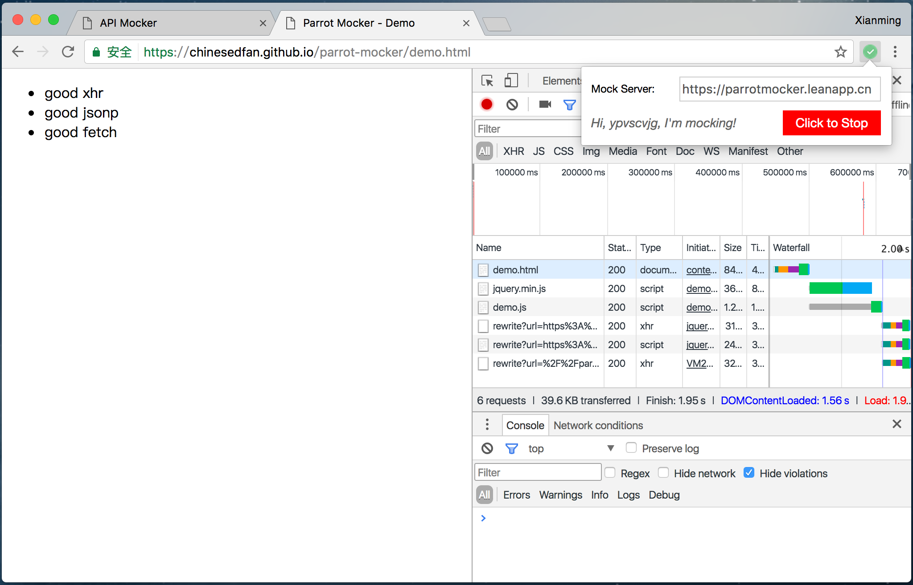
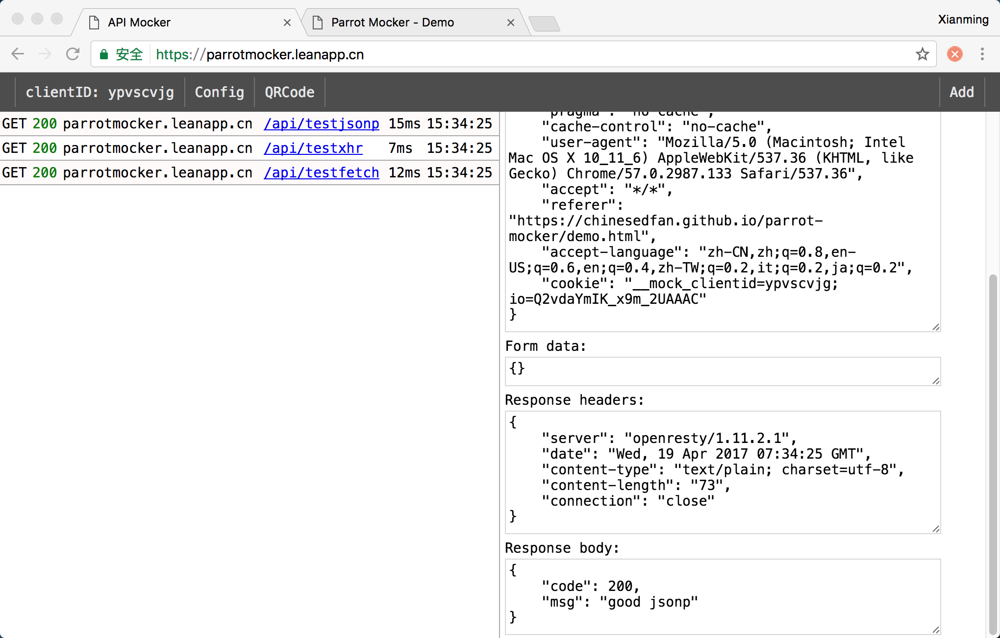
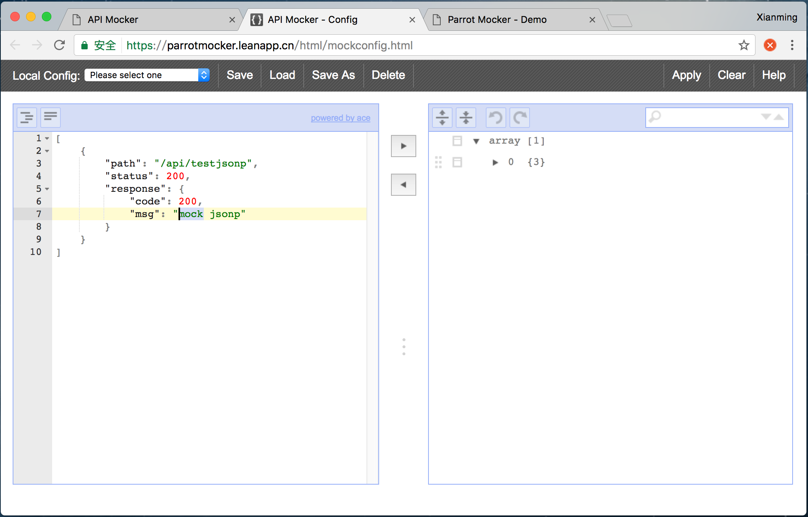
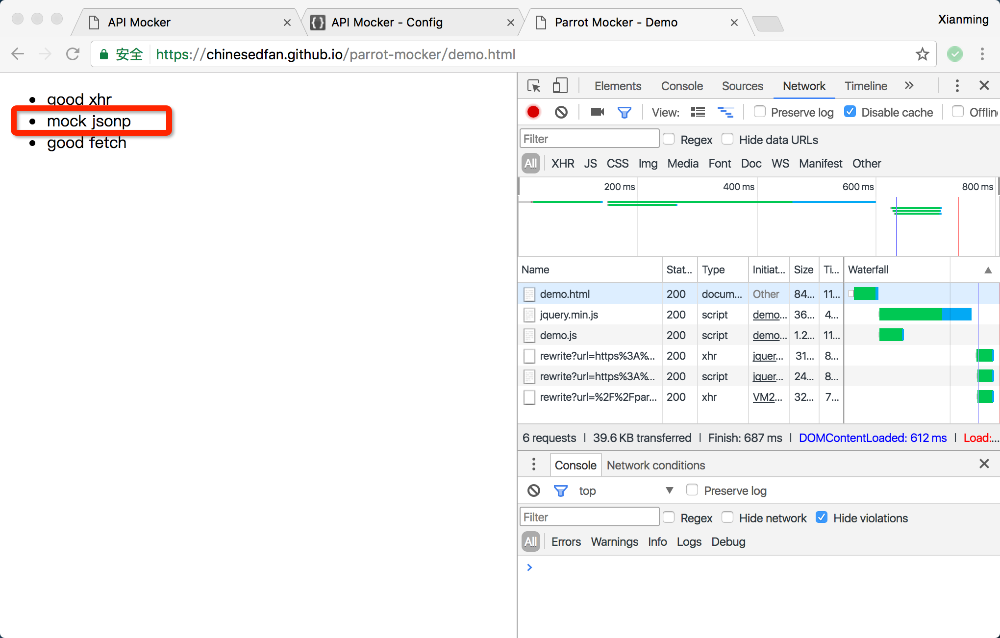
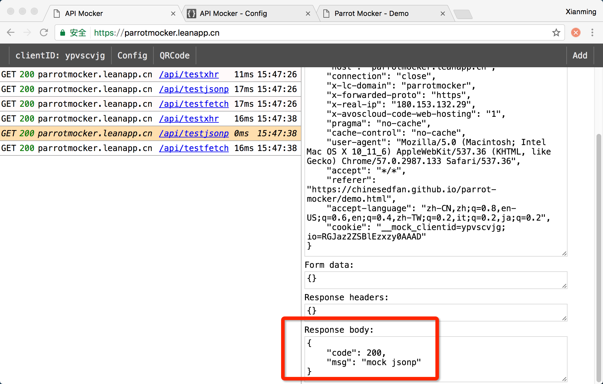

# parrot-mocker-web [](https://badge.fury.io/js/parrot-mocker-web) [](https://travis-ci.org/chinesedfan/parrot-mocker-web) [](https://coveralls.io/github/chinesedfan/parrot-mocker-web?branch=master) [][license]

项目提供一个简单的mock服务器，配合Chrome插件[parrot-mocker](https://github.com/chinesedfan/parrot-mocker)，支持：
- 转发页面请求(xhr/jsonp/fetch)到真正的web服务器，或者只返回mock数据
- 列表展示被转发的请求
- 针对特定请求配置特定mock数据

不支持：
- cookie敏感的请求，因为插件转发的请求只携带了'页面所在域'的cookie，而不是'请求本身的域'的cookie
- 相对于页面的请求或本地特有dns的请求，因为此类请求到达mock服务器后，无法解析到真正的host
- ~~https页面，除非把本项目部署成https~~（已部署到[leancloud][index-lean]和[now.sh][index-now]）

## 如何使用

### 1.准备

安装Chrome插件，[parrot-mocker](https://chrome.google.com/webstore/detail/parrotmocker/hdhamekapmnmceohfdbfelofidflfelm)，使得页面上的请求可以被拦截转发到mock服务器。其它非插件式用法，参考：[如何使用二维码](https://github.com/chinesedfan/parrot-mocker-web/blob/master/doc/zh/how-to-use-qrcode.md)。



### 2.访问

以项目部署在[leancloud][index-lean]为例，使用前必须先在Chrome中打开[首页][index-lean]。[now.sh][index-now]或其它部署地址类似。



正常访问需要测试的页面，例如：[demo页面](https://chinesedfan.github.io/parrot-mocker/demo.html)，该页面加载完后会分别发送xhr/jsonp/fetch三个请求。



打开插件输入mock服务器的地址并点击mock按钮，页面会自动刷新。



此时会发现页面请求已经被转发到了mock服务器，在[首页](https://parrotmocker.leanapp.cn)上也可以浏览到。如果再访问相同域的其它页面都将具有相同效果，因为插件在cookie中记录了转发相关信息。




### 3.Mock

选中请求列表中的任意请求，然后点击'Add'按钮，该请求就被添加到mock配置中。

打开[Config页面](https://parrotmocker.leanapp.cn/html/config.html)可以编辑mock数据，记得'Apply'才能让mock数据真正生效。参考：[如何配置](https://github.com/chinesedfan/parrot-mocker-web/blob/master/doc/zh/how-to-config.md)



刷新原来的测试链接，会发现数据已经被mock。




### 4.停止

点开插件然后点击红色按钮，页面将恢复原状。

## 本地启动

默认启动在主端口8080，子端口8442/8443。子端口只能通过对应的http/https方式访问，主端口同时支持两种协议。其中https因为是本地自签名的，所以浏览器会发出警告，选择继续访问即可。

```sh
node ./server/index.js
```

或者也可以通过环境变量来更换端口。

```sh
PORT=8888 HTTP_PORT=9442 HTTPS_PORT=9443 node ./server/index.js
```

为了使用本地服务，步骤2需要访问和在插件中输入本地地址作为mock server，例如：`https://127.0.0.1:8080`，其它步骤类似。

## 注意

- 为了重定向类请求能被正确处理，请确保服务器能通过你在Chrome插件中输入的mock server域名访问到自身。

## 开源协议

[MIT][license]

## 致谢

* [jsoneditor](https://github.com/josdejong/jsoneditor), json编辑器

[index-lean]: https://parrotmocker.leanapp.cn
[index-now]: https://parrotmocker.now.sh
[license]: https://github.com/chinesedfan/parrot-mocker-web/blob/master/LICENSE
